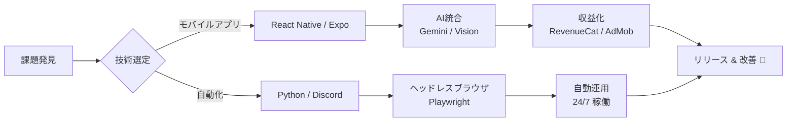

  

   

  
  
  
  

 

## 🧑‍💻 About Me

モバイルアプリ開発を軸に、**企画 → 設計 → 実装 → リリース → 収益化**までを一貫して行う学生エンジニアです。

- 🎓 大学生（現在）
- 📱 React Native / Expo でのiOS/Androidアプリ開発・**App Store公開経験あり**
- 🤖 Python + Playwrightによる業務自動化・Bot開発
- 🏆 RoboCup Junior 2019 Japan Open OnStage **優勝**
- 🎨 Esports チームのグラフィックデザイナー経験
- 🛍️ Shopifyを活用したアパレルEC運営経験

 

## 🛠 Tech Stack

<b>モバイル & フロントエンド</b>

 

<b>バックエンド & データベース</b>

 

<b>AI & クラウドサービス</b>

 

 

## 🚀 Featured Projects

### 📱 DiGer — 古着タグAI鑑定アプリ

> 古着のブランドタグを撮影するだけで、AIがブランド・製造年代・市場価格を瞬時に判定するiOS/Androidアプリ。

| 項目 | 内容 |
| :--- | :--- |
| **課題** | 古着の年代判定は専門知識が必要で、初心者には困難。プロの鑑定士に依頼するとコストと時間がかかる。 |
| **解決策** | Gemini 2.5 Flash を活用し、タグのデザイン・素材表記・アーカイブデータをAIが照合。最大3枚同時解析で精度向上。 |
| **技術的工夫** | デバイスID認証による課金管理、Express.js + PostgreSQLの認証APIサーバー構築、RevenueCatによるサブスク課金実装 |
| **成果** | **App Store公開済み** / サブスク3プラン設計 / バックエンドAPI自前構築・Render.comにデプロイ |
| **技術スタック** | React Native, TypeScript, Vision Camera, Express.js, PostgreSQL, Gemini 2.5 Flash, RevenueCat, AdMob |

 

### 💪 FormLab — AI筋トレフォーム解析

> トレーニング動画をAIが解析し、姿勢・動作のスムーズさ・安全性を100点満点でスコアリング。

| 項目 | 内容 |
| :--- | :--- |
| **課題** | パーソナルトレーナーなしでは正しいフォームの判断が難しく、怪我のリスクがある。 |
| **解決策** | Gemini 2.5 Flash でトレーニング動画を解析し、スコア・良い点・改善点・具体的アドバイスを自動生成。 |
| **技術的工夫** | 最大50秒の動画をAIに送信する効率的なパイプライン構築、Supabaseによるクラウド履歴管理 |
| **成果** | 解析履歴のクラウド保存 / RevenueCatによるサブスク課金実装 |
| **技術スタック** | React Native (Expo SDK 52), TypeScript, Gemini 2.5 Flash, Supabase, RevenueCat |

 

### 🤖 EC Auto-Vending Bot — Discord自動販売システム

> 仕入れ・在庫管理・決済確認・納品までを完全自動化したDiscord + Web上のEC自動販売システム。

| 項目 | 内容 |
| :--- | :--- |
| **課題** | デジタル商品の販売には、在庫管理・決済確認・納品の手作業が多く、24時間対応が困難。 |
| **解決策** | Discord Botで購入フローを自動化。PayPay決済の自動受取→商品引渡しまでを無人化。Webサイトからの購入チャネルも構築。 |
| **技術的工夫** | PayPay APIトークン認証の自動決済、5カテゴリの自動出品スケジューラー、Cloudflare Tunnelによるセキュアな公開、Dockerによるコンテナ運用 |
| **成果** | **24/7 完全無人運用を実現** / Discord + Web の2チャネル販売 / 利益トラッキング・システムステータス監視を搭載 |
| **技術スタック** | Python, discord.py, Flask, Playwright, PayPay API, Docker, Cloudflare Tunnel |

 

## 📜 Background & History

<b>🏫 小学生時代 — サーバー運営と技術の目覚め</b>

 

**Minecraftサーバー運営 (Java / Spigot / MySQL)**

小学生の頃からMinecraftサーバーのOwnerとして運営。バックエンド技術に触れる原体験となりました。

*   **経済システムの実装**: MySQLでゲーム内経済データ（所持金・取引履歴）を管理
*   **国内上位の成果**: 個人運営として同時接続数**25名**を達成
*   **インフラ管理**: サーバー負荷の監視とチューニングで安定稼働を実現

<b>🤖 中学生時代 — ロボティクスへの挑戦</b>

 

**RoboCup Junior / Team Forest**

*   **🏆 優勝**: **RoboCup Junior 2019 和歌山 Japan Open OnStage**
*   パフォーマンスロボットの設計・製作・プログラミングを担当

<b>🎨 高校生時代 — Esports デザイナー</b>

 

**Esports Designer / Graphic Design**

Esportsチームの専属デザイナーとして、プロゲーマーやチームのブランディングに貢献。  
📎 [Behance Portfolio](https://www.behance.net/NaiwaD)

<table>
  <tr>
    <td align="center"></td>
    <td align="center"></td>
  </tr>
  <tr>
    <td align="center"></td>
    <td align="center"></td>
  </tr>
</table>

<b>🎓 大学生時代（現在） — ビジネスとエンジニアリングの融合</b>

 

**Apparel Brand Management → Mobile App Development**

*   **アパレルブランド運営**: Shopifyを活用したセレクトショップの立ち上げ・ECサイト構築・マーケティング・販売戦略を一貫して経験
*   **モバイルアプリ開発**: ユーザー課題をアプリで解決し、App Storeに公開

 

## 🔄 Development Philosophy

  

