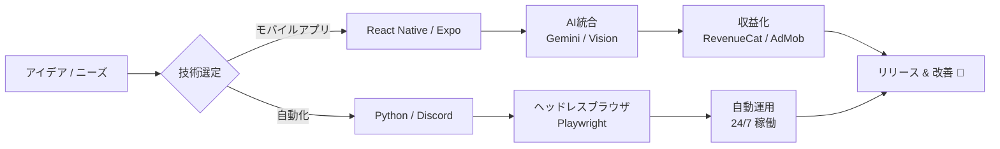

  
  
  # 👋 学生エンジニア / アプリ開発者です
  
  **モバイル開発 (React Native) | Python 自動化 | AI 統合**
   
  <i>現実世界とAIを繋ぐアプリを開発しています。</i>

   
  
  
  

 

## 📜 HISTORY & BACKGROUND

### 🏫 小学生時代: サーバー運営と技術の目覚め (Elementary School)

**Minecraftサーバー運営 (Java / Spigot / MySQL)**

小学生の時、MinecraftサーバーのOwnerとして運営を開始しました。単なるゲームプレイに留まらず、バックエンド技術に触れる原体験となりました。

*   **経済システムの実装**: MySQLを活用し、ゲーム内の経済データ（所持金・取引履歴）を管理するシステムを導入。
*   **国内上位の成果**: ユーザー体験（UX）を重視したサーバー設定により、個人運営としては国内上位となる**同時接続数25名**を達成。
*   **インフラ管理**: サーバー負荷の監視と継続的なチューニングを行い、安定稼働を実現しました。

 

### 🎨 中学生時代: クリエイティブへの没頭 (Junior High School)

**Esports Designer / Graphic Design**

中学生時代はEsportsチームの専属デザイナーとして活動し、プロゲーマーやチームのブランディングに貢献しました。

*   **主な活動**: 所属チームのクリエイティブ全般を担当。
*   **制作物**: プロプレイヤーのヘッダー画像、大会用クリエイティブなど。
*   **使用ツール**: Adobe Photoshop
*   **ポートフォリオ**: [Behance @NaiwaD](https://www.behance.net/NaiwaD)

<table>
  <tr>
    <td align="center"></td>
    <td align="center"></td>
  </tr>
  <tr>
    <td align="center"></td>
    <td align="center"></td>
  </tr>
</table>

 

### 🤖 高校生時代: ロボティクスへの挑戦 (High School)

**RoboCup Junior / Team Development**

高校ではロボティクス競技に打ち込み、技術力とチームワークを磨きました。

*   **🏆 優勝**: **RoboCup Junior 2019 和歌山 Japan Open OnStage**
*   **活動内容**: パフォーマンスロボットの設計・製作・プログラミング。チームリーダーとしてプロジェクト進行管理も担当。

 

### 🎓 大学生時代 (現在): ビジネスとエンジニアリングの融合 (University Student)

**Apparel Brand Management / Mobile App Dev**

大学生となった現在は、アパレルブランドの経営とモバイルアプリ開発を行っています。

*   **アパレルブランド運営**: ブランド「**TIER**」の立ち上げから運営までを一貫して担当。
    *   **Shopify**を活用したECサイト構築・運用。
    *   商品企画、マーケティング、販売戦略の立案。
*   **エンジニアリング**: ユーザー価値を最大化するアプリ開発（詳細はFeatured Projectsを参照）。

 

## 🛠 技術スタック

### モバイル & フロントエンド

### バックエンド & 自動化

### AI & クラウドサービス

 

## 🔭 注力分野 & スタイル

| テーマ | 詳細 | ツール |
| :--- | :--- | :--- |
| **モバイルAIアプリ** | カメラ映像を活用したAI解析アプリ開発 | **React Native, Vision Camera, Gemini Flash** |
| **Bot自動化** | Discord/Web操作の完全自動化・収益化 | **Python, Playwright, Discord.py** |
| **マネタイズ** | サブスクリプション・広告の実装設計 | **RevenueCat, AdMob** |
| **開発スタイル** | ユーザー価値最優先のMVP開発 → 計測 → 改善 | **Supabase, CI/CD** |

 

## 🚀 主要プロジェクト

### 📱 モバイルアプリケーション

| プロジェクト | 説明 | 技術スタック |
| :--- | :--- | :--- |
| **DiGer (VintageCheck)** | **古着タグAI解析アプリ** カメラで古着のタグを撮影し、年代や詳細をAIが即座に判定。 サブスクリプション機能搭載。 |    |
| **FormLab** | **AI筋トレフォーム解析** トレーニング動画をGemini 2.5 Flashで解析し、スコアと改善点を提示。 Supabaseによる履歴管理機能付き。 |    |

### 🤖 自動化 & Bot

| プロジェクト | 説明 | 技術スタック |
| :--- | :--- | :--- |
| **Valorant Auto-Vending** | **Discordアカウント自動販売Bot** 在庫検索・購入・PayPay入金確認・納品までを完全無人化。 Playwrightによる決済監視システム搭載。 |    |

 

## 🔄 開発哲学

